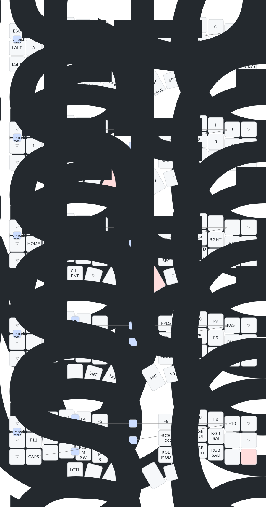

# Corne ZMK Mapping by Mike Szczys

Corne split keyboard mapping driven by [Frood RP2040 Pro Micro
Controllers](https://42keebs.eu/shop/parts/controllers/frood-rp2040-pro-micro-controller/).



Keymap originally based on the Corne layout [by Mark
Stosberg](https://mark.stosberg.com/markstos-corne-3x5-1-keyboard-layout/).

## Build

```
keymap parse -c 10 -q szczys_corne_qmk.json > szczys_corne_qmk.yaml
```

## Visualize keymap

Generate an SVG using [keymap
drawer](https://github.com/caksoylar/keymap-drawer)

### Prerequisite: Install keymap drawer

```
pip install keymap-drawer
```

Alternatively you may use [the web app](https://keymap-drawer.streamlit.app/).

### Generate the visualization

```
qmk c2json -km szczys -kb crkbd -o szczys_corne_qmk.json
keymap parse -c 10 -q szczys_corne_qmk.json > szczys_corne_qmk.yaml
./qmk_fix_yaml_keymap.py
keymap -c keymap_drawer_config.yaml draw szczys_corne_qmk.yaml > szczys_corne_qmk.svg
```

The `qmk_fix_yaml_keymap.py` is a hacky way of post-processing the yaml to
achieve the following results:
- Give the layers names
- Highlight the "held" key for each layer in pink
- Convert the `LT()` macros to tap/hold assignments (not sure why keymap-drawer
  is failing to parse these)
- Add combos

Layer names and all combo assignments must be manually added to this python
file when changes to those aspects are made on the keymap.
